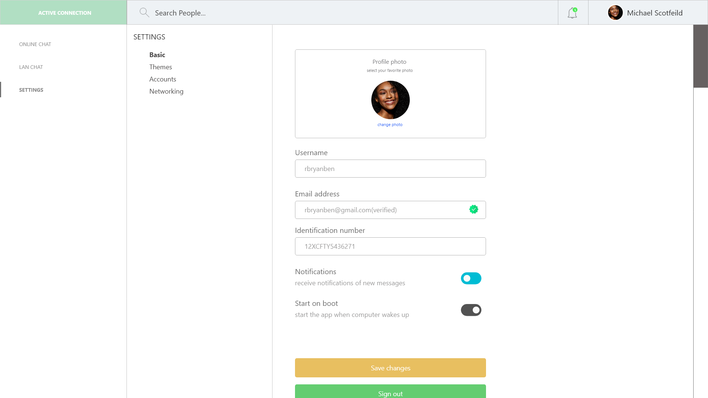

# ChatSock-v1.0.2
LAN and online desktop messaging application

# Design preview
  
  
  

# Online database configuration 
1) Set your RTD to follow the sample JSON
2) In firebaseConfigurations.cs set your secret key and database base
3) Thats it

# User interface and Experience
